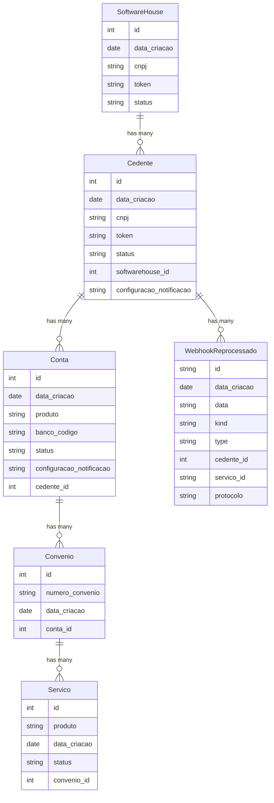

# Relationships

No sistema olhamos para os produtos do Plug Boleto (Boletos, Pagamentos, Pix, etc.). Onde cada produto é um serviço dentro do sistema.

## Overview

```sh
SoftwareHouse (1) ──< Cedente (N)
Cedente (1) ──< Conta (N)
Conta (1) ──< Convenio (N)
Convenio (1) ──< Servico (N)
Cedente (1) ──< WebhookReprocessado (N)

Note: WebhookReprocessado.servico_id is a JSON string (array of service IDs) and has no FK to Servico directly.
```

### Mermaid



## Nomenclatura

- `SoftwareHouse`: Software House (SH) é a empresa que vai implementar o sistema do Plug Boleto.
- `Cedente`: Cedente é quem vai emitir os boletos para o Sacado fazer o pagamento
- `Conta`: Conta é a conta do Cedente que vai receber o pagamento do Sacado
- `Convenio`: Convenio é a carteira da conta do Cedente
- `Servico`: Servico é o serviço que vai ser executado pelo Plug Boleto (Ele representa o produto: Boletos, Pagamentos, Pix, etc.)
- `WebhookReprocessado`: Webhook Reprocessado é o webhook que foi reprocessado e salvo no banco de dados junto ao protocolo de retorno.
